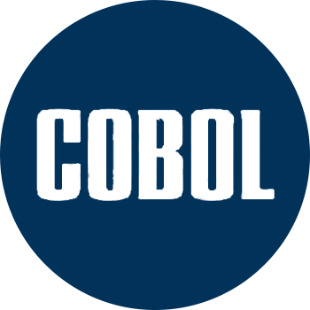

  

<h3 align="center">COBOL Project - Update accounts</h3>

---

 ...
      

## 📝 Table of Contents

- [📝 Table of Contents](#-table-of-contents)
- [🧐 About ](#-about-)
- [🎈 Usage ](#-usage-)
- [✍️ Authors ](#️-authors-)

## 🧠About 

The purpose of this repository is ...

## 🈠Usage 

...

## ✍️ Authors 

- [@Emericdefay](https://github.com/Emericdefay) - Program proposed
- [@BOUZIANI Mustafa](#) - Idea & Initial exercice
- [@Global Knowledge](https://www.globalknowledge.com/fr-fr) - Formation
